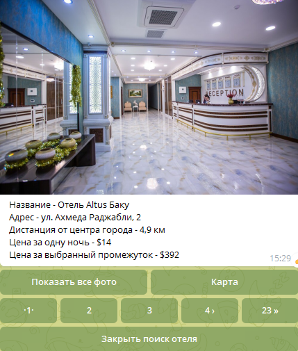

# Поиск отелей в Telegram

Этот бот позволяет быстро подбирать отели прямо в мессенджере Telegram по различным критериям поиска. 

## Особенности

Данный бот позволяет:
* подбирать отели по самой низкой или высокой цене;
* подбирать отели по лучшему соотношению цена/расстояние от центра города;
* задавать диапазон цен.

## Requirements

* Python 3.7+
* [pyTelegramBotAPI](https://github.com/python-telegram-bot/python-telegram-bot) – Python Telegram Bot API
* [requests](https://github.com/psf/requests) - библиотека requests
* [sqlite3]() - хранилище поисковых параметров каждого пользователя
* [python-telegram-bot-calendar](https://github.com/artembakhanov/python-telegram-bot-calendar/tree/master/examples) - календарь для выбора checkin-checkout
* [python-telegram-bot-pagination](https://github.com/ksinn/python-telegram-bot-pagination) - для пролистывания отелей и фото

Вы можете установить все зависимости, выполнив следующую команду: `pip install -r requirements.txt`

## Логирование

В скрипте этого бота используется модуль [loguru](https://github.com/Delgan/loguru) для логирования.

## Команды бота

* `/start` - запуск бота, выполняется автоматически при подключении к боту.
* `/help` - список команд и их описание
* `/reset` - для рестарта

## Как работать с ботом 

Список всех команд, поддерживаемых ботом, можно посмотреть по команде `/help`

### Вывод результата

Введите название населенного пункта. Бот выполнит запрос к hotels api
   Если бот не найдет ни одну локацию,то уведомляет,возможно вы допустили ошибку при написании. 

Бот выполнит следующий запрос к hotels api и выведет список отелей с указанием названия, класса, цены, адреса и расстояния от центра.

Пример результата:

